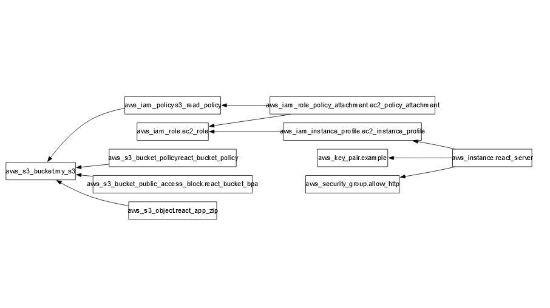

I created a s3 bucket and an s3_object which the correct acces roles for get/put-object operations. To enable this I used a s3_bucket_policy, public access block and an iasm policy to allow the role associated with my react server to read from it

I Created a EC2 instance which downloads a zipped react project from s3, configures it via apache to run on cloud_init via a custom bash script "user_data.sh"

Useful takeaways

To view output from cloud-init logs, debugging the user_data script when ran on start-up

`sudo cat /var/log/cloud-init-output.log`

To manually rerun the start up bash script execute the following

`sudo bash /var/lib/cloud/instance/scripts/part-001`

Graph image of the resources created

